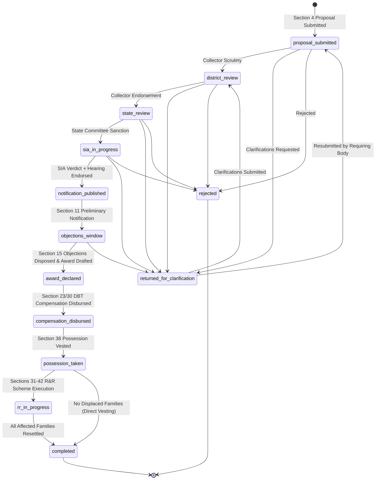

# LandSync — National Land Acquisition & Management System (NLAMS)

> **SIH 2026 Problem Statement PS 26016**: Digitize, accelerate, and ensure statutory transparency for land acquisition workflows under the **Right to Fair Compensation and Transparency in Land Acquisition, Rehabilitation and Resettlement (RFCTLARR) Act, 2013**.

LandSync is a full-stack, enterprise-grade GovTech platform built with **FastAPI (Python 3.11+)**, **SQLAlchemy 2.0**, **PostgreSQL 15+ with PostGIS / GeoAlchemy2**, and a modern **React 19 + Vite + TypeScript + Leaflet GIS** frontend. It enforces an 11-stage statutory acquisition lifecycle, hybrid **Role-Based Access Control (RBAC)** + **Attribute-Based Access Control (ABAC)** territorial jurisdiction scoping, and legally immutable audit trails.

---

## Key Capabilities

- **Interactive Cadastral GIS & BhuNaksha Integration**:
  - Vector polygon rendering via Leaflet with OpenStreetMap / CartoDB basemaps.
  - Dynamic statutory color-coding:
    - 🟢 **Green** (`clear`): Clear Title / Nil Encroachment
    - 🟡 **Amber** (`disputed`): Contested Title / Boundary Dispute
    - 🔴 **Red** (`encroached`): Physical Encroachment Verified
  - Live Khasra search with autocomplete suggestions and animated `flyTo` camera targeting.
  - Interactive **Parcel Inspector** drawer: Khasra number badge, Mauza/Village, Tehsil, Cadastral Revenue Sheet No, WGS-84 GPS Centroid with one-click copy, statutory area in hectares and square meters, ownership category, and case linkage.
  - Field Officer encroachment auditing with mandatory evidentiary document upload references.
- **Canonical 11-Stage Statutory RFCTLARR Workflow Engine**:
  - `proposal_submitted` → `district_review` → `state_review` → `sia_in_progress` → `notification_published` → `objections_window` → `award_declared` → `compensation_disbursed` → `possession_taken` → `rr_in_progress` → `completed` (with side states `returned_for_clarification` and `rejected`).
  - Strict stage transition state machine rejecting unauthorized or out-of-sequence jumps with **HTTP 409 Conflict**.
- **Hybrid RBAC + ABAC Territorial Jurisdiction Security**:
  - 7 administrative roles: Requiring Body, District Collector, State Approver, SIA Expert, R&R Administrator, Field Officer, and Policy Viewer.
  - Territorial matching: District Collectors and Field Officers are strictly restricted to their assigned district. Cross-district tampering triggers an immediate **HTTP 403 Forbidden**.
  - Policy Viewers hold national read-only access (all mutating calls blocked with **HTTP 403**).
- **Legally Immutable Audit Trail**:
  - Append-only relational audit ledger (`audit_logs`) tracking actor ID, action tag, previous/new stage, and timestamp.
  - Zero `UPDATE` or `DELETE` methods exposed in the data access layer.
- **Accessible & Multilingual GovTech UI**:
  - GIGW 3.0 & WCAG 2.1 AA/AAA compliant design tokens.
  - High Contrast mode toggle and font zoom controls (100% to 150%).
  - Multilingual support for English, Hindi, Bengali, Marathi, Tamil, and Telugu.

---

## System Architecture

```
                                  +-------------------------------------------------------+
                                  |                 LandSync Web Client                   |
                                  |     (React 19 + TypeScript + Vite + Leaflet GIS)      |
                                  +---------------------------+---------------------------+
                                                              |
                                                    REST / GeoJSON API (JWT)
                                                              |
                                                              v
+-------------------------------------------------------------------------------------------------------------------------+
|                                              FastAPI Backend (7-Layer Model)                                            |
|                                                                                                                         |
|  +--------------------+   +------------------------------------------------------------------------------------------+  |
|  |   1. core/         |   | config.py (typed settings), security.py (bcrypt hash, JWT sign/verify)                   |  |
|  +--------------------+   +------------------------------------------------------------------------------------------+  |
|  |   2. db/           |   | session.py (SQLAlchemy 2.0 pool, SQLite spatial fallback, seed triggers)                 |  |
|  +--------------------+   +------------------------------------------------------------------------------------------+  |
|  |   3. models/       |   | user.py, case.py, parcel.py (PostGIS Polygon), audit.py, document.py, workflow.py       |  |
|  +--------------------+   +------------------------------------------------------------------------------------------+  |
|  |   4. schemas/      |   | Pydantic v2 DTOs + RFC 7946 GeoJSON Feature & FeatureCollection models                   |  |
|  +--------------------+   +------------------------------------------------------------------------------------------+  |
|  |   5. repositories/ |   | CaseRepository, ParcelRepository (spatial bounding box), AuditRepository (append-only)  |  |
|  +--------------------+   +------------------------------------------------------------------------------------------+  |
|  |   6. services/     |   | stage_machine.py (11-stage graph), parcel_service.py (ABAC scoping), case_service.py    |  |
|  +--------------------+   +------------------------------------------------------------------------------------------+  |
|  |   7. api/routes/   |   | auth.py, cases.py, parcels.py (GeoJSON/GIS), analytics.py + dependencies.py (RBAC/ABAC) |  |
|  +--------------------+   +------------------------------------------------------------------------------------------+  |
+-------------------------------------------------------------+-----------------------------------------------------------+
                                                              |
                                                              v
                                  +-------------------------------------------------------+
                                  |                Relational & Spatial DB                |
                                  |       PostgreSQL 15 + PostGIS (GeoAlchemy2)           |
                                  |         (Local SQLite fallback for testing)           |
                                  +-------------------------------------------------------+
```

---

## Quick Start: One-Command Full-Stack Setup

### Prerequisites
- **Node.js**: v18.0 or higher
- **Python**: v3.11 or higher
- **Git**

### 1. Clone & Install Dependencies
```bash
git clone https://github.com/pranjalranjan27/LandSync.git
cd LandSync

# Install root orchestration packages
npm install

# Install Frontend dependencies (Leaflet, React 19, Lucide)
npm --prefix Frontend install

# Install Backend Python dependencies
py -3.12 -m pip install -r backend/requirements.txt
# (or pip install -r backend/requirements.txt)
```

### 2. Start Frontend & Backend Simultaneously
Run the central dev command from the root directory:
```bash
npm run dev
```

This starts:
- **Frontend SPA**: [http://localhost:5173](http://localhost:5173) (Vite dev server with automatic `/api`, `/cases`, `/parcels` reverse proxying).
- **FastAPI Backend**: [http://localhost:8000](http://localhost:8000) (Interactive Swagger Docs at [http://localhost:8000/docs](http://localhost:8000/docs)).

*(On startup, the SQLite fallback database automatically creates all relational and spatial tables and seeds 40 synthetic cadastral parcels in Gautam Buddha Nagar along with 7 demo accounts and 5 sample acquisition cases.)*

---

## Standalone Development Commands

### Backend Only
```bash
cd backend
py -3.12 -m uvicorn app.main:app --host 127.0.0.1 --port 8000 --reload
```

### Frontend Only
```bash
cd Frontend
npm run dev
```

### Docker Compose (Production PostgreSQL + PostGIS)
```bash
cd backend
docker compose up --build -d
docker compose exec api alembic upgrade head
docker compose exec api python -m app.seed.seed_data
```

---

## Pre-Seeded Demonstration Accounts

All accounts are pre-seeded with the password: **`password123`**

| Role Tag | Email Address | Jurisdiction Scope | Jurisdiction ID | UI Portal View |
| :--- | :--- | :--- | :--- | :--- |
| `requiring_body` | `requiring_body@landsync.gov.in` | District | Gautam Buddha Nagar | Proposal Form & Case Tracking |
| `district_collector` | `collector@landsync.gov.in` | District | Gautam Buddha Nagar | Scrutiny, Objections, Awards & GIS Map |
| `state_approver` | `state_approver@landsync.gov.in` | State | Uttar Pradesh | State Committee Approvals |
| `sia_expert` | `sia_expert@landsync.gov.in` | State | Uttar Pradesh | SIA Evaluation & Hearing Logs |
| `rr_administrator` | `rr_admin@landsync.gov.in` | District | Gautam Buddha Nagar | R&R Solatium & Resettlement Tracking |
| `field_officer` | `field_officer@landsync.gov.in` | District | Gautam Buddha Nagar | Encroachment Inspection & Boundary Vetting |
| `policy_viewer` | `policy_viewer@landsync.gov.in` | National | *All Jurisdictions* | Global GIS Viewer & SLA Analytics |

---

## Cadastral GIS (BhuNaksha) Specification

### RFC 7946 GeoJSON Feature Properties

```json
{
  "type": "Feature",
  "id": "e5e54a15-63c5-4e3d-9b3f-fd8a8d3d28fd",
  "geometry": {
    "type": "Polygon",
    "coordinates": [[[77.5588, 28.4090], [77.5612, 28.4092], [77.5613, 28.4110], [77.5589, 28.4110], [77.5588, 28.4090]]]
  },
  "properties": {
    "id": "e5e54a15-63c5-4e3d-9b3f-fd8a8d3d28fd",
    "khasra_number": "UP-GB-10026",
    "village": "Dayanatpur",
    "tehsil": "Jewar",
    "district": "Gautam Buddha Nagar",
    "state": "Uttar Pradesh",
    "revenue_sheet_no": "22-A",
    "centroid_lat": 28.4100,
    "centroid_lng": 77.5600,
    "area_sqm": 59140.8,
    "area_hectares": 5.9141,
    "encroachment_status": "clear",
    "ownership_type": "private",
    "case_id": 1
  }
}
```

### GIS REST Endpoints

| Method | Endpoint | Description | Access Control |
| :--- | :--- | :--- | :--- |
| `GET` | `/api/v1/parcels` | List GeoJSON FeatureCollection (`district`, `bbox` filters) | District Collector / Field Officer / Policy Viewer |
| `GET` | `/api/v1/parcels/search` | Search Khasra by partial string for map fly-to | Authenticated users |
| `GET` | `/api/v1/parcels/{id}` | Retrieve single parcel GeoJSON feature | Authenticated users |
| `POST` | `/api/v1/parcels/{id}/link-case` | Associate parcel with an acquisition case | Requiring Body / District Collector |
| `PATCH`| `/api/v1/parcels/{id}/encroachment-status` | Update statutory encroachment status with evidence ID | Field Officer (writes immutable audit log) |
| `GET` | `/api/v1/cases/{case_id}/parcels` | Retrieve all GeoJSON parcels linked to a case | Authenticated users with case jurisdiction |

---

## Statutory Workflow State Transition Graph



### Transition Permissions Matrix

| Current Stage | Permitted Next Stages | Required Role |
| :--- | :--- | :--- |
| `proposal_submitted` | `district_review`, `returned_for_clarification`, `rejected` | `district_collector` |
| `district_review` | `state_review`, `returned_for_clarification`, `rejected` | `district_collector` |
| `state_review` | `sia_in_progress`, `returned_for_clarification`, `rejected` | `state_approver` |
| `sia_in_progress` | `notification_published`, `returned_for_clarification`, `rejected` | `district_collector` (requires prior `sia_expert` verdict) |
| `notification_published` | `objections_window` | Automatic upon notification publication |
| `objections_window` | `award_declared`, `returned_for_clarification` | `district_collector` |
| `award_declared` | `compensation_disbursed` | `district_collector` |
| `compensation_disbursed` | `possession_taken` | `district_collector` |
| `possession_taken` | `rr_in_progress`, `completed` | `district_collector` / `rr_administrator` |
| `rr_in_progress` | `completed` | `rr_administrator` |
| `returned_for_clarification` | `proposal_submitted`, `district_review` | `requiring_body` |
| `rejected` | *None (Terminal)* | - |
| `completed` | *None (Terminal)* | - |

---

## Automated Verification & Testing

### Running Pytest Suite
```bash
py -3.12 -m pytest backend/tests
```
Executes 19 end-to-end tests covering:
- Cross-district collector isolation (HTTP 403).
- Authorized district collector GeoJSON FeatureCollection queries.
- Policy Viewer global read-only access and mutation blocking (HTTP 403).
- Spatial bounding box queries (`ST_Intersects` / coordinate bounds).
- Khasra search and centroid coordinates for map fly-to.
- Case parcel linkage and append-only audit log entry generation.
- Encroachment status validation (requiring `evidence_document_id`) and audit logging.
- Stage transition graph validation and illegal jump rejection (HTTP 409).
- Append-only audit log immutability.

### Running Frontend Typecheck & Build
```bash
npm --prefix Frontend run build
```
Executes `tsc -b` and `vite build` validating complete TypeScript type safety and minification.

### Running Frontend Linting
```bash
npm --prefix Frontend run lint
```
Executes `oxlint` for high-performance AST linting.

---

## Pre-Seeded Sample Cases

1. **Case #1 (`proposal_submitted`)**: *Jewar Airport Rail Cargo Link Phase 1* (5 parcels in Gautam Buddha Nagar).
2. **Case #2 (`district_review`)**: *Greater Noida Metro Line Extension Phase 3* (6 parcels in Gautam Buddha Nagar).
3. **Case #3 (`sia_in_progress`)**: *Yamuna Expressway Industrial Sector 24* (8 parcels, SIA evaluation underway).
4. **Case #4 (`completed`)**: *Noida Power Grid Substation Alpha* (4 parcels acquired, full audit history).
5. **Case #5 (`rr_in_progress`)**: *Dadri Multimodal Logistics Hub Expansion* (10 parcels, ₹48.5 Cr award declared, 3 affected families tracked).

---

## License

Developed for the **Smart India Hackathon (SIH 2026)** under Problem Statement **PS 26016**.
All rights reserved.
